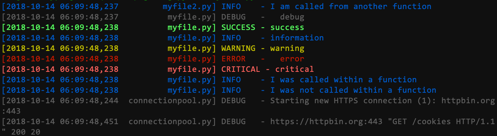

# Log3
[](https://pypi.org/project/log3/)
[](https://pypi.org/project/log3/)
[](https://codecov.io/gh/orlandodiaz/log3)
[](https://travis-ci.com/orlandodiaz/log3)




`Log3` makes it easier to log messages in Python. It comes with a strong default
logging configuration system so you don't configure them yourself.

Here are it's main highlights:
- **Easy to use**. Just import the module and start using it. This will work for most cases. Unless your logging settings are very specialized
you won't have to tinker much with the configuration.
- **Strong defaults**. The default formatter and date formatter will work for just about anyone. It includes the date, time, filename, level, and message. If you need to use a different formatter you can
also do so just as easily.
- **New logging methods**. In addition to `log.info`, `log.debug`, etc `log3` also comes with `log.success` to log out successful messages
- **Colored output for terminals**. If you're working with the terminal the messages will be colored by default without any additional configuration
- **Easier file logging**. No need to create a file handler with new date formatting, and formatting and attach to the logger. The same configuration for `STDERR`
also applies to the log. Just import `log_to_file` and specify the path of the log as the argument.

## Installation

You can install `Log3` using pip:

    pip install log3

## Usage

To start logging it is as simple as importing the `log` logger object and issuing the logging
commands:

```python
from log3 import log

log.info("Hello world")
log.success("This message was successful")
log.debug("This is a debug message")
log.warning("This is a warning")
log.error("This is an error")
log.critical("This is  a critical error")
```


#### Log to file
The `log_to_file` function will allow you to add a file handler to yor logging configuration.

First import it

    from log3 import log_to_file

Now you can do:


    log_to_file('file')
    log.info('logged to file')

#### Disable logging

You can quickly disable logging rather than hardcoding it into your logging
configuration file.

    log.disable_logging()

To enable logging again it is also that simple:

    log.enable_logging()

